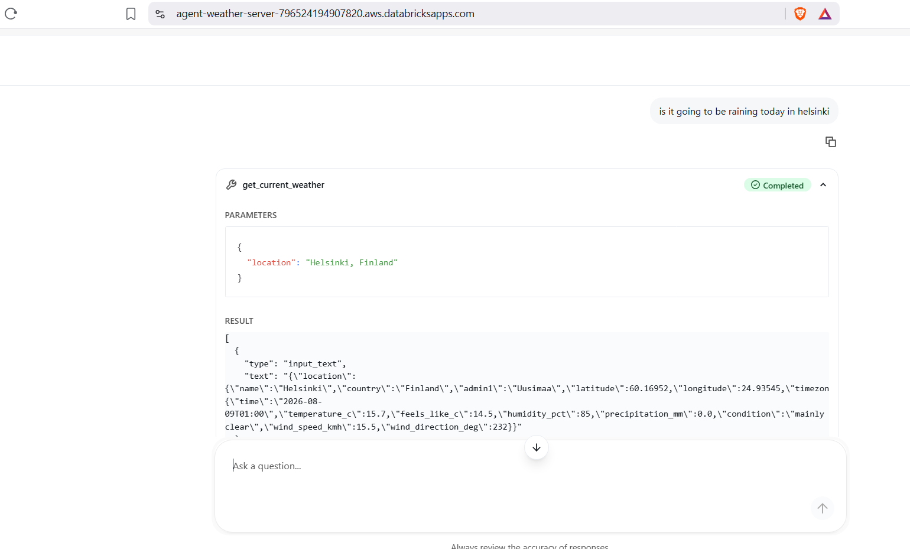
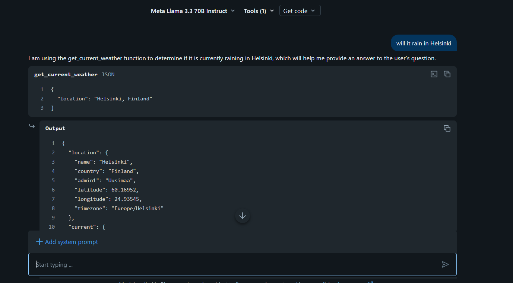
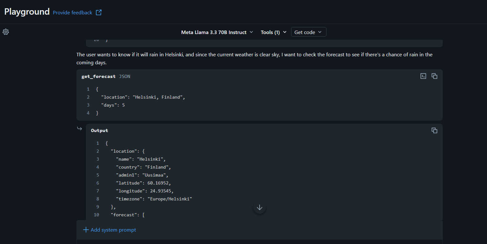
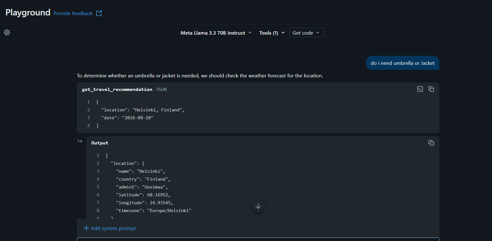

# Weather-Prediction MCP Server + Agent

Homework submission — Day 3 pattern (Agent Bricks + external MCP server),
applied to a free weather API instead of Alpaca Markets.

## Architecture

```
Agent Bricks agent  --(MCP tool calls)-->  mcp_server/weather_mcp_server.py  --(REST)-->  Open-Meteo (free, no key)
```

- `mcp_server/` is a single Databricks App exposing 3 weather tools over
  streamable HTTP — the transport Databricks' MCP gateway expects.
- `mcp_server/weather_broker.py` is the adapter module: every HTTP call to
  Open-Meteo and all response parsing happens here. `weather_mcp_server.py`
  only resolves a location, calls the broker, and returns a clean dict —
  no raw `requests` calls inside the `@mcp.tool` functions.
- No dashboard, no Lakebase, no secrets — nothing here needs persistent
  state, so there's nothing to configure beyond the code itself.

## Weather API + auth

**[Open-Meteo](https://open-meteo.com/)** — free, no signup, no API key,
up to 10,000 non-commercial calls/day. Two endpoints are used:

- Geocoding (`geocoding-api.open-meteo.com/v1/search`) — resolves a city
  name to lat/lon.
- Forecast (`api.open-meteo.com/v1/forecast`) — current conditions and
  daily forecast, up to 16 days out.

No secrets to store — this is why the assignment recommends starting here
instead of a key-based API.

## Tools

| Tool | Description |
|---|---|
| `get_current_weather(location)` | Current temperature, feels-like, humidity, precipitation, condition, wind. |
| `get_forecast(location, days)` | Daily high/low, precipitation probability, and condition for the next N days (max 16). |
| `get_travel_recommendation(location, date)` | Derived judgment for a specific date: recommends an umbrella if precipitation probability > 40%, and a jacket if the day's low is under 10°C. Returns the reasoning, not just raw numbers. |

## Run locally

```bash
cd mcp_server
pip install -r requirements.txt
python weather_mcp_server.py   # serves MCP on :8000
```

Sanity-check with `curl` or an [MCP Inspector](https://docs.databricks.com/aws/en/agents/mcp-tools/connect-clients)
against `http://localhost:8000/mcp` before deploying.

## Deploy to Databricks Apps (Free Edition)

1. Create a Git folder in your workspace pointing at this repo (Workspace
   > Git folder > add repo, no CLI needed).
2. Compute > Apps > **Create app** > Custom. Name it something starting
   with `mcp-` (e.g. `mcp-weather-server`) — Databricks uses that prefix
   to recognize it as an MCP server in the AI Playground.
3. Point the app's source at this Git folder's `mcp_server/` subfolder so
   it picks up `mcp_server/app.yaml`.
4. Deploy, then copy the app's URL — the MCP endpoint will be at
   `https://<app-url>/mcp`.

## Connect the MCP server to an agent

**What actually works**: AI Playground's and Agent Bricks' native **Custom
MCP Server** tool picker (**Tools** > **Add tools** > **Custom MCP
Server**). Any deployed Databricks App whose name starts with `mcp-` is
auto-discovered here — select `mcp-weather-server` and its 3 tools become
available immediately. No connection, no credentials, no separate
registration step.

**What doesn't work (on Free Edition, as of this testing)**: registering
the app as a Unity Catalog **MCP Service** via **AI Gateway** > **MCPs** >
**Create MCP Service**, which proxies calls through a UC HTTP connection.
Every authentication method offered there — Bearer token (PAT), PAT-based
OAuth token exchange, OAuth U2M shared, OAuth M2M — was rejected with a
`401 Unauthorized` coming directly from Databricks' platform layer
(`server: databricks` in the response), before the request ever reached
the app (confirmed via the app's own request logs showing nothing for
these attempts at all). Most likely cause: the "Unity AI Gateway Beta" /
"Managed MCP Servers preview" isn't enabled on this account. If you hit
the same wall, don't burn time on auth configuration there — skip straight
to the Custom MCP Server tool picker instead.

## Deploy the agent (Export to Databricks Apps)

Rather than building through **Agents > Agent Bricks**, this agent was
deployed via **AI Playground's Export to Databricks Apps** — Databricks'
current recommended path for turning a Playground prototype into a real
deployed agent. It installs the `agent-openai-agents-sdk` template with
your exact model, system prompt, and tool wiring, generates a real
`agent_server/agent.py`, and deploys it with a built-in chat UI —
functionally equivalent to an Agent Bricks agent, just a different product
surface (lives under **Compute > Apps** alongside the MCP server, not
under Agents > Agent Bricks).

1. In **AI Playground**, select a tools-enabled model, add
   `mcp-weather-server` via **Tools** > **Custom MCP Server** (same tool
   picker used to test it earlier).
2. Click **+ Add system prompt** and paste in the prompt below.
3. **Get code** > **Export to Databricks Apps**. Name it (e.g.
   `agent-weather-server`) and export — Databricks installs the template,
   wires up permissions to the MCP server automatically, and deploys it.
4. Click **View Agent** to open the deployed app's own chat UI at
   `https://<agent-app-url>.aws.databricksapps.com`.

System prompt used:

   > You are a weather-prediction assistant. Use `get_current_weather` for
   > "right now" questions, `get_forecast` for multi-day questions, and
   > `get_travel_recommendation` for anything about what to bring or wear
   > on a specific date. Only answer for locations you can resolve — if a
   > tool call fails because a location can't be found or the API is
   > unreachable, say so plainly rather than guessing. Always state the
   > reasoning behind a recommendation (the precipitation chance or
   > temperature that triggered it), not just the yes/no answer.

Capture screenshots of at least 3 different questions and the agent's
tool calls + final answers for the submission — see **Demo** below.

## Demo

### Deployed agent (`agent-weather-server`)

The real submission artifact — the app exported in the previous section,
running independently of Playground at its own URL.

**"Is it going to be raining today in Helsinki"** — calls
`get_current_weather` and returns the current conditions.



**Still need**: 2 more examples from this same deployed app to fully
cover the "3 different questions" requirement from here rather than from
Playground below — e.g. "Should I bring a jacket to Austin this weekend?"
(`get_travel_recommendation`) and "What's the 5-day forecast for Austin?"
(`get_forecast` standalone, not chained).

### Playground prototyping (earlier testing, Meta Llama 3.3 70B Instruct)

Kept for reference — this is where the MCP server connection and tool
behavior were first validated, before exporting the agent above.

#### "Will it rain in Helsinki"

The model chains two tool calls on its own: `get_current_weather` first to
check conditions right now, then — seeing clear skies — proactively calls
`get_forecast` to check whether rain is coming over the next few days
before answering.




#### "Do I need umbrella or Jacket"

The model resolves "tomorrow" to a concrete date and calls
`get_travel_recommendation` directly, returning the reasoned judgment
(precipitation chance and low temperature vs. thresholds) rather than raw
forecast numbers.



## Not in this version (possible next steps)

- **Dashboard app** (optional, for extra credit) — a small read-only page
  showing recent agent queries. Deferred for now to keep the submission
  simple; would need a shared store (e.g. Lakebase) between the MCP server
  and the dashboard, since they'd be separate processes.
- Stretch tools: severe weather alerts (NWS API), historical lookups,
  multi-city comparison.